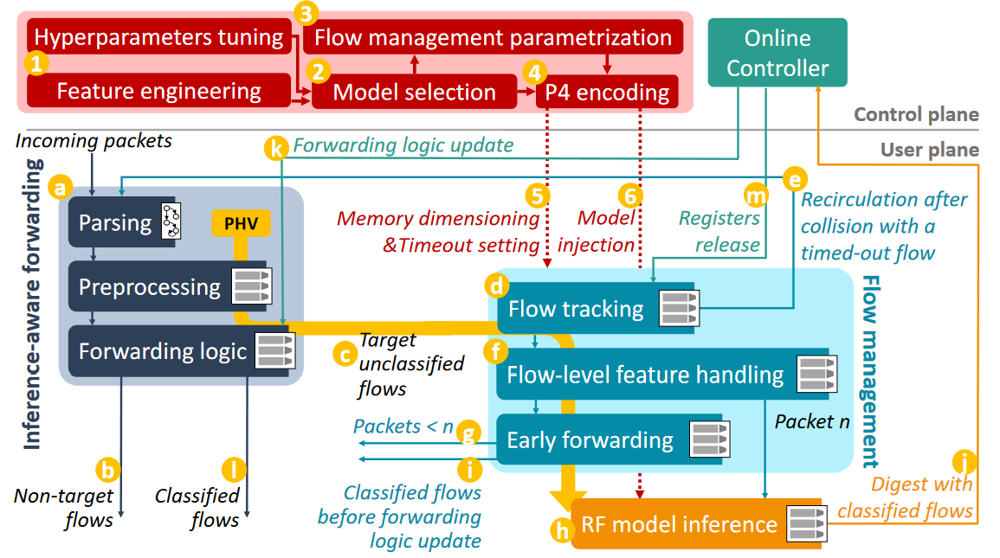

# Flowrest: Practical Flow-Level Inference in Programmable Switches with Random Forests

This repository contains the public version of the code for our work Flowrest which will appear in the Proceedings of IEEE INFOCOM 2023, 17-20 May 2023, New York Area, USA.

## Overview of the Flowrest system
  

Flowrest is a practical framework that can run Random Forest (RF) models at flow-level in real-world programmable switches. It
enables the embedding of large RF models into production-grade programmable hardware, for challenging inference tasks
on individual traffic flows at line rate. Flowrest is implemented as open-source software using the P4 language.

For full details, please consult <a href="https://dspace.networks.imdea.org/handle/20.500.12761/1649">our paper</a>.

## Organization of the repository  
There are two folders:  
<!-- - _Data_ : information on how to access the data  -->
- _P4_ : the P4 code for Tofino and the M/A table entries
- _Python_ : the jupyter notebooks for training the machine learning models, and the python scripts for generating the M/A table entries from the saved trained models.

## Use cases
The use cases considered in the paper are: 
- IoT device identification task based on the publicly available <a href="https://iotanalytics unsw.edu.au/iottraces.html">UNSW-IOT Traces</a>. <br>The challenge is to classify traffic into one of 16 or 26 classes. 
- Protocol classification with 8 protocol classes, based on the <a href="http://netweb.ing.unibs.it/~ntw/tools/traces/">UNIBS 2009 Internet Traces</a>.
- Intrusion detection system separating malware from benign traffic. <br> It is based on the <a href="https://www.unb.ca/cic/datasets/ids-2017.html">CICIDS 2017 Friday</a> dataset containing DDoS attacks and normal traffic.

We provide the python and P4 code for the UNSW-IoT device identification use case with 16 classes. <br> The same approach for feature/model selection and encoding to P4 applies to all the use cases. You can access the train/test files for this example from this<a href="https://box.networks.imdea.org/s/xV7P5bunjxbiSh1"> Box folder</a>.

## Citation
If you make use of this code, kindly cite our paper:  
```
@inproceedings{flowrest-2023,
author = {Akem, Aristide Tanyi-Jong and Gucciardo, Michele and Fiore, Marco},
title = {Flowrest: Practical Flow-Level Inference in Programmable Switches with Random Forests},
year = {2023},
publisher = {},
address = {},
url = {https://dspace.networks.imdea.org/handle/20.500.12761/1649},
doi = {},
booktitle = {Proceedings of the 2023 IEEE International Conference on Computer Communications},
numpages = {10},
location = {New York, USA},
series = {INFOCOM 2023}
}
```

If you need any additional information, send us an email at _aristide.akem_ at _imdea.org_


